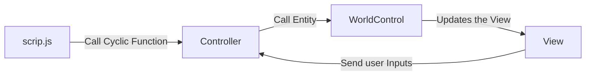
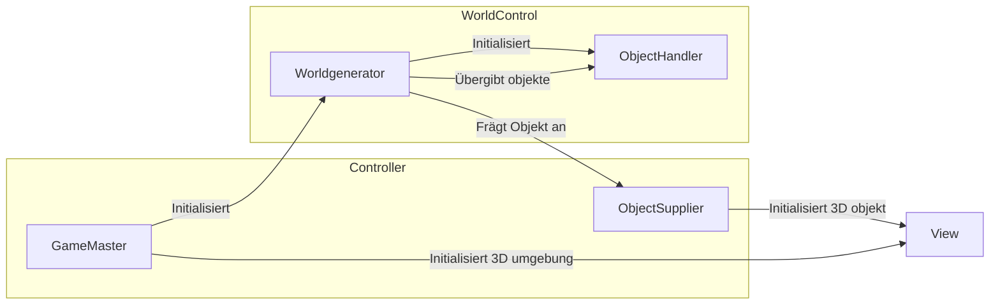
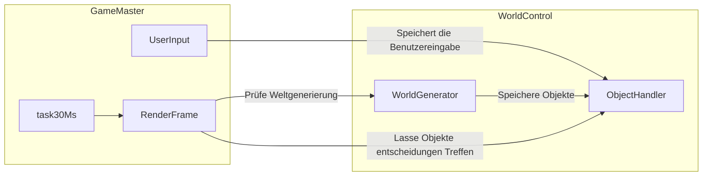
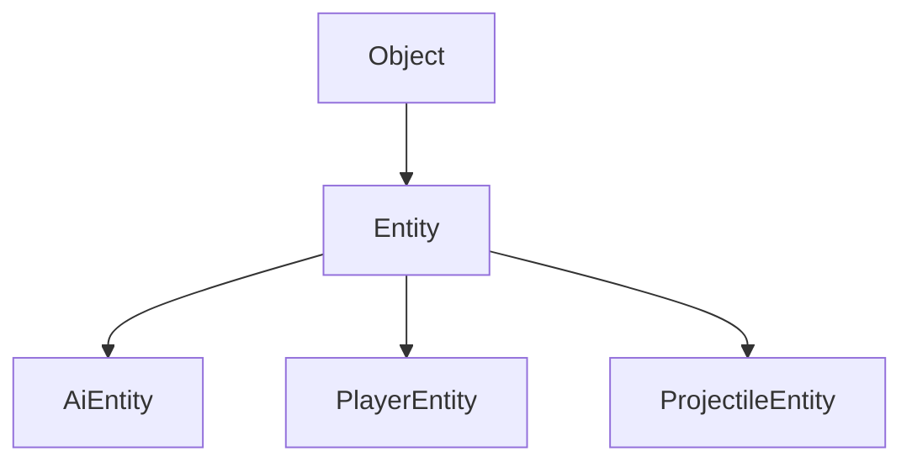
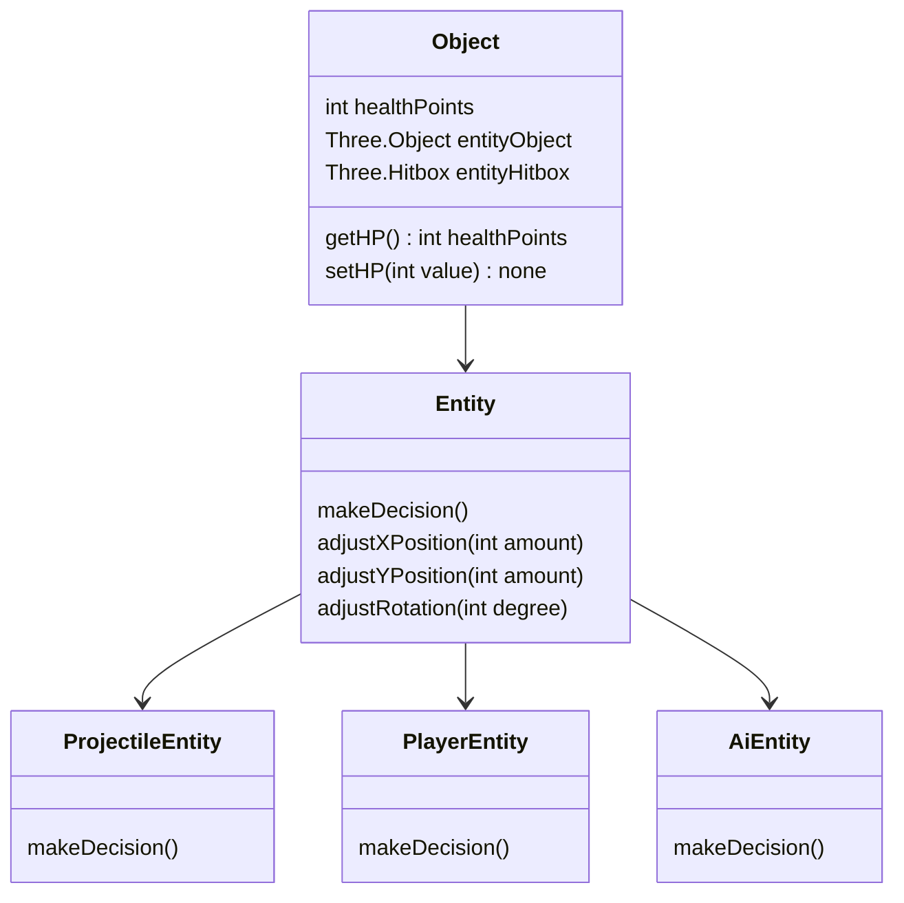

# Dokumentation

# 1. Idee des Projekts

## 1.1 Design-Idee

Für das Fach Computergrafiken sollte ein Projekt entwickelt werden. Schnell wurde der Entschluss gefasst, ein Spiel zu entwickeln. Nach interner Rücksprache wurde sich aufgrund der Zeit für ein Spiel, angelegt an Space-Invaders, entschieden. 

Hierbei soll es sich bei der 3D Umgebung um einen länglichen Korridor handeln. Hierbei beginnt das Spieler Objekt am unteren Ende des Korridors. Ziel des Spiels ist es, das obere Ende des Korridors zu erreichen. Hierbei sollen statische Hindernisse und Computergegner als Herausforderung dienen. Siehe hierzu Abbildung 1 Punkt 1.


Im Rahmen der UI soll der Spieler nur einen Teil des Spielfelds sehen. Hierbei erhält die 3D Oberfläche 3/5 der Bildschirmbreite. Die linke und rechte Seite des Bildschirms ist für die Darstellung der Spielinformation und Lebensanzeigen gedacht. Siehe hierzu Abbildung 1 Punkt 2.

## 1.2 Verwendete Tools

Die Webseite Basiert auf den Standardtools HTML mit CSS sowie Javascript. Die Funktionalitäten von Javascript werden durch THREE.js erweitert. Hierbei handelt es sich um eine 3D Rendering Engine auf Basis von WebGL.

# 2. UI/UX

## 2.1 UI

### 2.1.1 Spielbildschirm

Bei der Gestaltung der UI wurde sich an der Design-Idee orientiert (siehe 1.1 Design-Idee). 

TODO: Bild einfügen

Beim Spielebildschirm ist das Verhältnis 1/3/1. Wobei 3/5 für das Spiel vorgesehen sind und jede Infoscreen 1/5 des Bildschirms erhalten.

Hierbei enthät der Rechte Infoscreen eine Kurze Hintergrundgeschickte zum Spiel und der Umgebung. Zusätzlich sind Steuerungen zum einstellen der Schwierigkeit sowie zum Starten & Pausieren des Spiels vorhanden.

Der Linke Infoscreen enthält den Spielenamen, die Anleitung zur Steuerung des Spielerobjekts sowie die Steuerung des Spielerobjekts.

Zusätzlich hierzu sind mittels HTML ein Warnhinweis über das Verlassen des Spielfelds, sowie das Anzeigen des Endbildschirms realisiert. Diese sind standardmäßig unsichtbar und werden mittels Javascript Code je nach Bedarf sichtbar oder unsichtbar geschaltet.

### 2.1.2 Ladebildschirm

Der Ladebildschirm ist statisch mittels HTML und CSS gelöst. Das Ausblenden erfolgt über das Sichtbarschalten des Spielbildschirms. Der Spielbildschirm besitzt dabei einen höheren Z-Index als der Ladebildschirm, weshalb dieser durch den Browser im Vordergrund angezeigt wird.

Der Wechsel vom Ladebildschirm zum Spielbildschirm erfolgt, sobald alle 3D Objekte geladen, sowie das Spiel initialisiert sind. Somit ist die dauer der anzeige des Ladebilschirms abhängig von der Rechenleistung sowie den Ladevorgängen des Javascirpt cods.

TODO:Bild einfügen

## 2.2 Steuerung

Das Spiel ist unter ausschließlicher Verwendung der Tastatur möglich. Hierbei ist eine Steuerung in auf allen drei Achsen möglich. 

- Die Bewegung nach Links und Rechts werden durch die Tasten a und s gesteuert.
- Nach vorne und hinten kann über die Tasten w und s kontrolliert werden.
- Zusätzlich ist die Höhensteuerung über die Tasten q und e für unten und oben implementiert.
- Das Abschießen eines Projektiels wird mittels Leertaste gesteuert

Hierbei wird die Steuerung im Spiel auf der Linken Infoseite zusätzlich angezeigt (siehe hierzu 2.1 UI)

Die Empfangenen Daten werden dabei mittels Push Prinzips aus der View an den Controller übergehen (siehe hierzu 3.2 Controller)

## 2.3 Physikalisches Verhalten

Die Objekte des Projekts verfügen über eine Physik Engine aus Eigenentwicklung. Hierbei wird mittels der THREE.js Boxhelper Funktion eine Hitbox um jedes erzeugte Objekt generiert. Bei Bewegungen wird untersucht, ob sich die Hitbox des Objekts mit einer anderen Hitbox überschneidet. Ist dies der Fall, wird abhängig vom Typen des Objekts das Verhalten gesteuert.

- Bei einer Kollision mit einem Projektil werden beide Objekte zerstört.
- Bei der Kollision mit Objekten soll die weitere Bewegung in Richtung des anderen Objekts verhindert werden.

Eine Erweiterung des physikalischen Verhaltens ist, dass jedes Objekt eine Beschleunigungsfunktion hat. Hierbei wird abhängig von der Dauer der Bewegung in eine Richtung die Beschleunigung bis zu einem Maximum erhöht.

$$
ZPosition = ZPosition + (Geschwindigkeitsfaktor * ZGeschwindgkeit)
$$

```jsx
const speedMultiplier = 0.5;
const speedReduceFactor = speedMultiplier / 2;
const speedCap = 10;
const speedFactor = 0.07;
const shootCap = 15;
const LeftRightCap = 25;
```

Hierbei neigt sich das Raumschiff in jene Richtung, in welche geboostet wird um das Verhalten von Trustern zu simulieren. Das Verhalten des Entitys wird mittels Konstanten zu Beginn des Programms definiert. 

Die Neigung des Schiffs wird mittels einer Formel berechnet. Hierbei wird die Rotation des Schiffs durch eine Multiplikation der Maximalrotation mit der Aktivrotation gebildet.

$$
Schiffsrotation = Maximalrotation * Activrotation
$$

Die Maximalrotation ist eine Konstante bestehend aus PI geteilt durch das Rotationsmaximum. Hierbei bedeutet PI für THREE.js eine Rotation des Objekts um 180 Grad. Durch eine Teilung von PI kann festgelegt werden, wie viel Grad die maximale Rotation betragen darf.

$$
maxRotation = \dfrac{Math.PI}{RotationMax}
$$

Die Formel der Aktivrotation ergibt eine Zahl zwischen 0 und 1. Dadurch wird der Faktor der Rotation bestimmt. Dieser wird durch die aktuelle Beschleunigung ermittelt. Da die Aktivgeschwindigkeit die Maximalgeschwindigkeit nicht überschreiten kann, ist der Wert wie zuvor genannt zwischen 0 und 1 begrenzt.

$$
Aktivrotation = \dfrac{Aktivgeschwindigkeit}{Maximalgeschwindigkeit}
$$

# 3. Softwarearchitektur

## 3.1 Basis

Die Softwarearchitektur, welche in dieser Arbeit verwendet wird, ist eine auf Basis des MVC Patterns entwickelte Architektur. Da die Anwendung über kein Backend mit Datenspeicherung über die aktuelle Sitzung hinaus verfügt, wird kein Backend verwendet.

Die Architektur besteht aus der View, welche für das Erstellen und Rendern der 3D Oberfläche sowie dem Bereitstellen von Objekten dient. Diese werden durch den Controller empfangen und in einen Internen Datenspeicher abgelegt. Die abgespeicherten Daten werden dabei in regelmäßigen Abständen aufgerufen. Dabei findet die Entscheidung, wie die Objekte reagieren im Bereich der Objects statt. Ihre Entscheidung teilen diese direkt der View mit.

Dieser Ablauf ist in der Abbildung unterhalb dieses Abschnitts dargestellt.



## 3.2 Controller

Der GameMaster ist die Zentrale Interaktionsschnittstelle des Programms. Dieser stellt für das von der index.html aufgerufene script.js die Kommunikationsschnittstellen zur Verfügung. Diese umfassen zwei Funktionen. 

Teil eins ist der Aufruf der Weltinitialisierung. Hierbei wird mit der Initialisierung der GameMaster Instanz das Programm geladen. Dies umfasst zum einen die Initialisierung der 3D Oberfläche, welche in der View angesiedelt ist. Sobald die 3D oberfläche erstellt ist, wird eine Instanz des WorldGenerators erstellt. Dieser berechnet Variablen wie die Größe des Spielfelds oder auch die Anzahl an gegnern. Ist dies erfolgt, initialisiert er den EntityHandler. Diesem übergibt der WorldGenerator die zuvor berechneten Objekte. Die Instanzen der Objekte erhät der Worldgenerator aus dem ObjectSupplier. Hierbei erhält der Objectsupplier die gerendeten 3D Modelle von der View. Siehe hierzu Abbildung TODO



Teil zwei ist die Laufzeit des Programms. Diese kann in zwei Bereiche unterteilt werden. Zum einen handelt es sich hierbei um das Abspeichern der Benutzereingabe. Diese wird von der View an den GameMaster mittels PushPrinzips übergeben. Der GameMaster übergibt die erhaltenen Daten darauf hin an den ObjectHandler, welcher diese im Spieler Objekt abspeichert. Dies ist im oberen Pfad der Abbildung TODO dargestellt.



Der Untere Pfad der Abbildung TODO beschreibt das Kontinuierliche Abfragen der Objekte und Animationen. Für eine Flüssige Animation wird die RenderFrame Funktion durch den TimeHandler in definierten Abständen aufgerufen. Die Standardeinstellung ist alle 30 Millisekunden und damit etwas schneller als 30FPS (33Ms pro Animation). 

Die RenderFrame lässt den Worldgenerator prüfen, ob neue Objekte generiert werden müssen. Ist dies der Fall generiert der WorldGenerator die Objekte und übergibt die Instanzen an den ObjectHandler.

Im Anschluss an den WorldGenerator wird durch die RenderFrame Funktion im ObjectHandler alle Objekte welche Entitys (siehe WorldControl). sind nacheinander aufgerufen. Hierbei wird von diesen die makeDecision Funktion aufgerufen, welche sich um die Entscheidungen und aufrufe von Animationen kümmert (siehe WorldControl).

## 3.3 View

Zur Visualisierung des Projektes wird Three JS verwendet.  In der View wird die Three JS Scene erstellt, Modelle zur View hinzugefügt und Kollisionen von Objekten überprüft.

## 3.5 WorldControl

Idee/ Ziel des Models

Das Model enthält die Entscheidungslogik für Vorgänge, die im Spiel “Roffelson- The Space Warrior” stattfinden.

Diese Speichern die Verbindung zu den Objekten in der View und enthalten die Entscheidungslogik über d

Aufbau des Models

Die Klasse Object sowie dessen Kindklassen beinhalten die Hauptfunktion des Models. Dabei vererbt die Klasse Object seine Funktionalitäten wie Deklarationen und  Methoden nicht nur an die Klasse Entity, sondern auch an die PlayerEntity, AiEntity und die ProjectileEntity. 

 Kürzen:


Jedes Object bekommt sogenannte “Healthpoints”. Diese stellen Trefferpunkte für den Spieler, den Asteroiden sowie für Feinde dar. Dabei ist der Wert der Trefferpunkte entweder 1 oder 0, die Zahl Eins suggeriert, dass ein Object “lebt” und somit auf dem Bildschirm angezeigt wird. Die Zahl Null, dass das Object nicht angezeigt wird. Außerdem wird jedes Object als ein Three-Object mit einer Three-Hitbox initialisiert. 

Insgesamt wird die Logik für das Treffen von Entscheidungen jeweils in den Methoden makeDecision() der Entities hinterlegt.

Die PlayerEntity sorgt dafür, dass Eingaben durch den Spieler im Programm korrekt verarbeitet werden. Die makeDecision() Funktion der PlayerEntity regelt das Schießen eines Projektils und das Bewegen des Spielers. Dabei wird abhängig von DOM-Events, hier Keyboard-Eingaben, ein jeweiliges Ereignis ausgeführt. Bei einer Eingabe von Pfeiltasten auf der Tastatur etwa bewegt sich der Spieler in die entsprechende Richtung. Wird der Key “Leertaste” erkannt, feuert der Spieler ein Projektil ab. Darüber hinaus sind das Bewegen und Schießen auch über das Klicken auf die jeweiligen Buttons auf dem Bildschirm möglich.

Die AiEntity verleiht den Gegnern im Spiel ein zufälliges Verhalten in Bezug auf das Bewegen und das Schießen. In der makeDecision() Funktion werden mittels weiteren Methoden der Math.js Library zufällige Zahlen erzeugt, die das Bewegungsmuster des gegnerische Raumschiffs beinflussen. Allerdings gibt es den Zusatz, dass sich die gegnerischen Raumschiffe an das Spielerverhalten anpassen und sich mit dem Spieler mitbewegen. Dies ermöglicht ein besseres Spielerlebnis, da das Spiel somit anspruchsvoller gemacht wird. 





# 4. Installationsanleitung

Zur Ausführung des Programmes wird Node JS benötigt. Die neuste LTS von Node JS kann hier heruntergeladen werden: [https://nodejs.org/en/download/](https://nodejs.org/en/download/) 

Zum Starten des Programms, wechseln Sie in an jene Stelle auf ihrem Computer, an welchem Sie diesen Projektordner gespeichert haben. Führen Sie im **TODO: Abgabeordnername:** DHBW_CG_PA Ordner den Befehl ‘npm install’ aus. Sobald dieser erfolgreich alle Packete installiert hat können Sie die Anwendung mittels ‘npm start’ starten. Um auf die Anwendung zugreifen zu können, öffnen Sie ihren Browser und gehen auf die Seite [http:localhost:3000](http://localhost:3000/)

# Quellenverzeichnis

## Informationsquellen

## 3D Modelle

## Grafiken

Favicon: [Start, Rakete, Raumfahrt, Raumschiff Symbol in Space Flat (icon-icons.com)](https://icon-icons.com/de/symbol/Start-Rakete-Raumfahrt-Raumschiff-spaceship-startup/106797)
